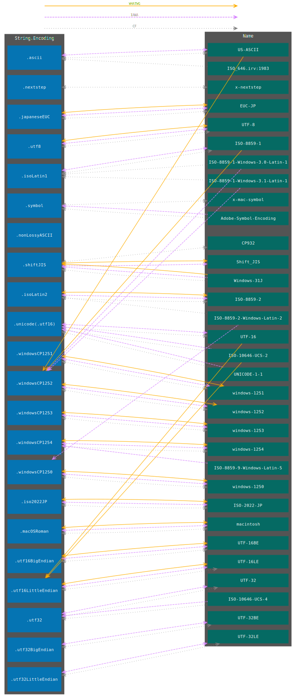

# String Encoding Names

* Proposal: Not assigned yet <!-- [FOU-NNNN](NNNN-filename.md) -->
* Author(s): [YOCKOW](https://GitHub.com/YOCKOW)
* Review Manager: TBD
* Status: Pitch <!-- **Awaiting implementation** or **Awaiting review** -->
<!-- * Bug: *if applicable* [apple/swift#NNNN](https://github.com/apple/swift-foundation/issues/NNNNN) -->
* Implementation: [StringEncodingNameImpl/StringEncodingName.swift](https://github.com/YOCKOW/SF-StringEncodingNameImpl/blob/main/Sources/StringEncodingNameImpl/StringEncodingName.swift)
<!-- * Previous Proposal: *if applicable* [FOU-XXXX](XXXX-filename.md) -->
<!-- * Previous Revision: *if applicable* [1](https://github.com/apple/swift-evolution/blob/...commit-ID.../proposals/NNNN-filename.md) -->
* Review: ([Pitch](https://forums.swift.org/t/pitch-foundation-string-encoding-names/74623))


## Introduction

This proposal allows `String.Encoding` to be converted to and from various names.

For example:

```swift
// Based on IANA registry
print(String.Encoding.utf8.name(.iana)!) // Prints "UTF-8"
print(String.Encoding(iana: "ISO_646.irv:1991") == .ascii) // Prints "true"

// Based on WHATWG Living Standard
print(String.Encoding.macOSRoman.name(.whatwg)!) // Prints "macintosh"
print(String.Encoding(whatwg: "us-ascii") == .windowsCP1252) // Prints "true"
```


## Motivation

String encoding names are widely used in computer networking and other areas. For instance, you often see them in HTTP headers such as `Content-Type: text/plain; charset=UTF-8` or in XML documents with declarations such as `<?xml version="1.0" encoding="Shift_JIS"?>`.

Therefore, it is necessary to parse and generate such names.


### Current solution

Swift lacks the necessary APIs, requiring the use of `CoreFoundation` (hereinafter called "CF") as described below.

```swift
extension String.Encoding {
  var nameInLegacyWay: String? {
    // 1. Convert `String.Encoding` value to the `CFStringEncoding` value.
    //    NOTE: The raw value of `String.Encoding` is the same with the value of `NSStringEncoding`,
    //          while it is not equal to the value of `CFStringEncoding`.
    let cfStrEncValue: CFStringEncoding = CFStringConvertNSStringEncodingToEncoding(self.rawValue)

    // 2. Convert it to the name where its type is `CFString?`
    let cfStrEncName: CFString? = CFStringConvertEncodingToIANACharSetName(cfStrEncValue)

    // 3. Convert `CFString` to Swift's `String`.
    //    NOTE: Unfortunately they can not be implicitly casted on Linux.
    let charsetName: String? = cfStrEncName.flatMap {
      let bufferSize = CFStringGetMaximumSizeForEncoding(
        CFStringGetLength($0),
        kCFStringEncodingASCII
      ) + 1
      let buffer = UnsafeMutablePointer<CChar>.allocate(capacity: bufferSize)
      defer {
        buffer.deallocate()
      }
      guard CFStringGetCString($0, buffer, bufferSize, kCFStringEncodingASCII) else {
        return nil
      }
      return String(utf8String: buffer)
    }
    return charsetName
  }

  init?(fromNameInLegacyWay charsetName: String) {
    // 1. Convert `String` to `CFString`
    let cfStrEncName: CFString = charsetName.withCString { (cString: UnsafePointer<CChar>) -> CFString in
      return CFStringCreateWithCString(nil, cString, kCFStringEncodingASCII)
    }

    // 2. Convert it to `CFStringEncoding`
    let cfStrEncValue: CFStringEncoding = CFStringConvertIANACharSetNameToEncoding(cfStrEncName)

    // 3. Check whether or not it's valid
    guard cfStrEncValue != kCFStringEncodingInvalidId else {
      return nil
    }

    // 4. Convert `CFStringEncoding` value to `String.Encoding` value
    self.init(rawValue: CFStringConvertEncodingToNSStringEncoding(cfStrEncValue))
  }
}
```


### What's the problem of the current solution?

- It is complicated to use multiple CF-functions to get a simple value. That's not *Swifty*.
- CF functions are legacy APIs that do not always fit with modern requirements.
- CF APIs are not officially supposed to be called from Swift on non-Darwin platforms.


## Proposed solution

The solution is straightforward.
We introduce a function that return the name, and initializers that create an instance from the name as shown below.
An enum `NameType` is also introduced to specify the type of the name, following `Locale` as precedent[^locale-precedent]. 

[^locale-precedent]: `Locale` has an enum named [`IdentifierType`](https://developer.apple.com/documentation/foundation/locale/identifiertype) to specify which kind of identifier should be used.

```swift
extension String.Encoding {
  /// A type that indicates the standard that defines an encoding's name.
  public enum NameType {
    /// The type of names that are registered by IANA (Internet Assigned Numbers Authority).
    case iana

    /// The type of names that are provided by WHATWG (Web Hypertext Application Technology Working Group)
    case whatwg
  }

  /// Returns the encoding name specified by the given `type`.
  public func name(_ type: NameType) -> String?

  /// Creates an instance from the name of the IANA registry "charset".
  public init?(iana: String)

  /// Creates an instance from the name of the WHATWG encoding.
  public init?(whatwg: String)
}
```

## Detailed design

This proposal refers to "[Character Sets](https://www.iana.org/assignments/character-sets/character-sets.xhtml)" published by IANA and to "[The Encoding Standard](https://encoding.spec.whatwg.org/)" published by WHATWG. While the latter may claim the former could be replaced with it, it entirely focuses on Web browsers (and their JavaScript APIs).

As shown in `String.Encoding`-Name conversion graph below, they are incompatible, making it difficult to compromise. Although you may want to ask which is better, the choice of which to use depends on your specific needs[^your-specific-needs]. Since Swift APIs should be more universal, here we consult both.

[^your-specific-needs]: You may just want to parse an old XML document on local.


*The graph of `String.Encoding`-Name conversions*

<details><summary>Notes to the graph</summary><div>

- Only names concerned with current `String.Encoding`s appear.
- Names here make use of the ones IANA publish in principle.
- Foundation assumes UTF-16 without BOM is big endian when decoding.

</div></details>


### `String.Encoding` to Name

- Upper-case letters may be used unlike CF.
  * `name(.iana)` returns *Preferred MIME Name* or *Name* of the encoding defined in "IANA Character Sets".
  * `name(.whatwg)` returns *Name* of the encoding defined by "The Encoding Standard".


### Name to `String.Encoding`

- `init(iana:)` adopts "Charset Alias Matching" defined in [UTX#22](https://www.unicode.org/reports/tr22/tr22-8.html#Charset_Alias_Matching).
  * i.g., "u.t.f-008" is recognized as "UTF-8".
- `init(iana:)` behaves consistently about ISO-8859-*.
  + For example, CF inconsistently handles "ISO-8859-1-Windows-3.1-Latin-1" and "csWindows31Latin1".
- `init(whatwg:)` adopts case-insensitive comparison described in [§4.2. Names and labels](https://encoding.spec.whatwg.org/#names-and-labels) of The Encoding Standard.


### Rationales for controversial points

- While "ISO_646.irv:1983"(a.k.a. "Code page 1009") is resolved into `.ascii` by CF, it is, strictly speaking, incompatible with "US-ASCII".
  This proposal decides that `String.Encoding` can't be initialized from "ISO_646.irv:1983".
- "CP51932" was regarded as a variant of "EUC-JP" formulated by Microsoft.
  It was, however, intended to be used mainly by web browsers (i.e. Internet Explorer considering the historical background) on Windows.
  As a result, it is incompatible with the original "EUC-JP" widely used on UNIX.
  Thus, "CP51932" should not be bound to `.japaneseEUC`.
- "CP932" is no longer available for a name of any encodings. Consequently, `String.Encoding.shiftJIS.name(.iana/.whatwg)` returns "Shift_JIS".
- "Windows-31J" is a variant of "Shift_JIS" extended by Microsoft.
  For the historical reason, `String.Encoding.shiftJIS` is an encoding equivalent to `kCFStringEncodingDOSJapanese` in CF (not to `kCFStringEncodingShiftJIS`), which means that `.shiftJIS` should be created from the name "Windows-31J" as well.


## Source compatibility

These changes proposed here are only additive. However, care must be taken if migrating from CF APIs.


## Implications on adoption

This feature can be freely adopted and un-adopted in source code with no deployment constraints and without affecting source compatibility.


## Future directions

`String.init(data:encoding:)` and `String.data(using:)` will be implemented more appropriately[^string-data-regression].

[^string-data-regression]: https://github.com/swiftlang/swift-foundation/issues/1015


## Alternatives considered

### Expose APIs only for the IANA Character Sets

Modern Web browsers have unfortunately deviated from the IANA's charset list. That means that it is better to adhere to the WHATWG Encoding Standard if you handle mainly web contents. We often require "The Living Standard" to cover such use cases.


### Expose APIs only for the WHATWG Encoding Standard

As mentioned above, the WHATWG Encoding Standard focuses on latest Web browsers. This can cause issues in some cases.

Imagine handling an XML 1.1 file declaring that its encoding is "ISO-8859-1": `<?xml version="1.1" encoding="ISO-8859-1"?>`. What if that file contains a byte `0x85`? `0x85` is recognized as `U+0085`(`NEL`) in ISO-8859-1 which is a valid end-of-line character in XML 1.1[^U+0085-in-xml].

[^U+0085-in-xml]: https://www.w3.org/TR/xml11/#sec-line-ends

On the other hand, the WHATWG Encoding Standard argues that "ISO-8859-1" label must be resolved as "windows-1252". A byte `0x85` is decoded to `U+2026`(`Horizontal Ellipsis`) in windows-1252 and that may cause fatal error to parse the XML file.

In such cases, consulting the IANA registry is necessary.


### Consolidate them

We might be able to consolidate them into a single kind of API like this:

```swift
extension String.Encoding {
  public var name: String? { get }
  public init?(name: String)
}
```

However, this approach would be too arbitrary and too difficult to maintain consistent behavior.


## Acknowledgments

Thanks to everyone who gave me advices on the pitch thread; especially to [@benrimmington](https://github.com/benrimmington) and [@xwu](https://github.com/xwu) who could channel their concerns into this proposal in the very early stage.
